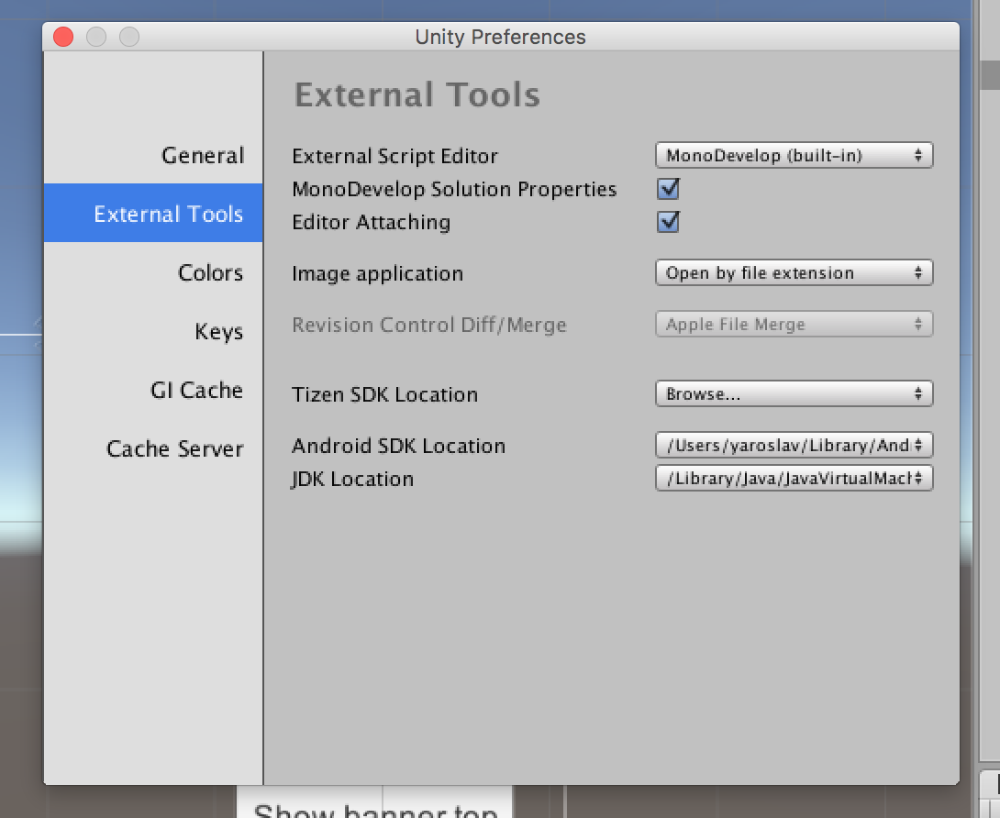
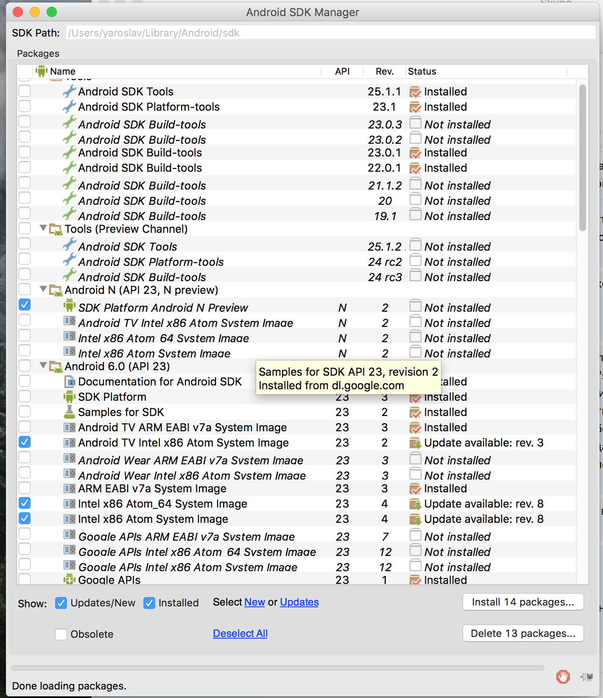

Android common errors
--------------------- 

When you trying to build your **apk** unity might throw build error. It might be caused of old Android API Level. The latest version of Admob library requires **API Level 23** . To download this packages go to you **Android SDK** (the path for it find here). 

Then install packages from SDK manager.

If you have another errors please contact us support@area730.com 
